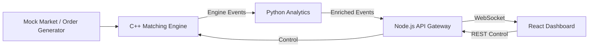

# System Architecture

## 1. Overview

The system uses a polyglot, event-driven architecture:



The architecture intentionally assigns each language a role where its ecosystem is appropriate.

---

## 2. Architectural Principles

### 2.1 Separation of concerns

The matching engine does not render UI. The React application does not calculate exchange matching. Python does not own browser connections.

### 2.2 Event-driven processing

A market event enters the pipeline once and is transformed as it moves through services.

### 2.3 Loose coupling

Services communicate through explicit message contracts rather than importing one another's implementation details.

### 2.4 Replaceability

The initial socket transport can later be replaced by Protobuf/gRPC or a message broker without rewriting the order-book algorithm.

---

## 3. Service Responsibilities

| Service | Main responsibility | Suggested technology |
|---|---|---|
| Engine | Orders, book, matching, event generation | C++17 |
| Analytics | Indicators and risk | Python 3 |
| Gateway | REST, WebSocket, auth, fan-out | Node.js/Express |
| Dashboard | Visualization and controls | React/TypeScript |
| Orchestration | Network and lifecycle | Docker Compose |

---

## 4. C++ Engine

The engine is the authoritative component for order-book state.

### Internal modules

```text
engine-cpp/
├── include/
│   ├── order.hpp
│   ├── order_book.hpp
│   ├── trade.hpp
│   ├── market_event.hpp
│   ├── matching_engine.hpp
│   ├── simulator.hpp
│   └── transport.hpp
├── src/
├── tests/
└── Makefile
```

### Responsibilities

- Validate orders.
- Assign IDs.
- Maintain bids and asks.
- Apply price-time priority.
- Generate trades.
- Maintain remaining quantity.
- Emit events.
- Generate deterministic mock data.

---

## 5. Order Book Design

A conceptual representation is:

```text
ASKS
105.00  [A17:100] [A19:50]
104.00  [A11:20]
103.00  [A04:80]

-------------------------
       MARKET
-------------------------

BIDS
102.00  [B20:30]
101.00  [B09:100] [B10:50]
100.00  [B01:70]
```

Best ask is the lowest ask.

Best bid is the highest bid.

Within a price level, earlier orders have priority.

---

## 6. Matching Algorithm

For a buy:

```text
while quantity > 0
and best ask exists
and buy price >= best ask:

    execute against oldest best-ask order
    trade_qty = min(incoming_qty, resting_qty)

    reduce both quantities

    remove fully consumed orders
```

For a sell:

```text
while quantity > 0
and best bid exists
and sell price <= best bid:

    execute against oldest best-bid order
    trade_qty = min(incoming_qty, resting_qty)

    reduce both quantities

    remove fully consumed orders
```

The algorithm must preserve deterministic ordering.

---

## 7. Transport Boundary

### Initial design

The initial transport is a TCP or Unix-domain socket stream.

Example event:

```json
{
  "event": "trade",
  "event_id": "evt-000123",
  "timestamp": "2026-09-07T12:00:01.250Z",
  "symbol": "SIM",
  "price": 101.25,
  "quantity": 25,
  "taker_side": "BUY",
  "buy_order_id": "B-100",
  "sell_order_id": "S-044"
}
```

Newline-delimited JSON is recommended for the first implementation because it is easy to debug with command-line tools.

---

## 8. Python Analytics

Python acts as a consumer of engine events.

Pipeline:

```text
Engine event
    ↓
Parser
    ↓
Validation
    ↓
Rolling state
    ↓
Indicators
    ↓
Risk/PnL
    ↓
Enriched event
```

Example enriched event:

```json
{
  "event": "analytics_update",
  "price": 101.25,
  "quantity": 25,
  "vwap": 101.12,
  "sma": 101.08,
  "ema": 101.15,
  "position": 150,
  "realized_pnl": 125.50,
  "unrealized_pnl": 62.25,
  "drawdown": 18.40
}
```

---

## 9. Node Gateway

The gateway provides the browser-facing contract.

### REST

Used for:

- health checks,
- lifecycle control,
- configuration,
- summaries.

### WebSocket

Used for:

- live trade events,
- price updates,
- analytics,
- status changes.

The gateway should not become the source of truth for order-book state. It is a transport and presentation boundary.

---

## 10. React Dashboard

React maintains a bounded client-side event buffer.

For example:

```text
MAX_POINTS = 500
```

When a new event arrives:

1. Parse message.
2. Validate message type.
3. Append to state.
4. Remove oldest point if buffer exceeds limit.
5. Update chart and metric cards.

This prevents an unlimited browser memory growth problem during long simulations.

---

## 11. Communication Patterns

### Engine → Analytics

Initial:

```text
TCP/Unix socket
NDJSON messages
```

Future:

```text
gRPC + Protobuf
```

### Analytics → Gateway

Initial:

```text
TCP/HTTP callback
```

Future:

```text
Redis Streams / PubSub
```

### Gateway → Dashboard

```text
WebSocket
```

### Dashboard → Gateway

```text
REST
```

---

## 12. Docker Architecture

```text
                    trading-network
                         |
        +----------------+----------------+
        |                |                |
   engine-cpp      analytics-py      gateway-node
                                           |
                                           |
                                      dashboard-react
```

Internal ports should be exposed only when necessary.

The public browser-facing service should be the gateway/dashboard entry point.

---

## 13. Failure Handling

### Engine unavailable

Analytics retries with bounded backoff.

### Analytics unavailable

Gateway marks analytics as unhealthy and continues serving health/control endpoints where possible.

### Gateway unavailable

Dashboard automatically attempts WebSocket reconnection.

### Malformed event

The consumer logs the error and rejects the individual message rather than crashing the process.

---

## 14. Backpressure

A high-rate producer can overwhelm a slower consumer.

The architecture should therefore define:

- bounded queues,
- maximum message sizes,
- batching where appropriate,
- drop/coalesce policies for non-critical display updates,
- graceful degradation.

The matching engine must not silently lose authoritative trade events.

---

## 15. Scaling Model

The MVP runs as one instance of each service.

A future deployment could use:

```text
                    Load Balancer
                         |
              +----------+----------+
              |                     |
        Gateway #1              Gateway #2
              |                     |
              +----------+----------+
                         |
                    Redis / Stream
                         |
                Analytics workers
```

The C++ matching engine is intentionally treated as stateful. Horizontal scaling would require partitioning by instrument or a more sophisticated distributed ownership model.

---

## 16. Architecture Decision Records

### ADR-001 — C++ for matching

**Decision:** C++17.

**Reason:** deterministic performance, explicit memory management, strong data-structure support, and relevance to systems programming.

### ADR-002 — Python for analytics

**Decision:** Python.

**Reason:** rapid experimentation and mature numerical/data ecosystem.

### ADR-003 — WebSockets for live dashboard

**Decision:** WebSockets.

**Reason:** server push avoids continuous polling.

### ADR-004 — Sockets before shared memory

**Decision:** start with sockets.

**Reason:** easier debugging and lower implementation complexity. Shared memory becomes a measurable optimization rather than premature complexity.

### ADR-005 — Docker Compose

**Decision:** Compose for local orchestration.

**Reason:** simple multi-service startup and reproducibility.
